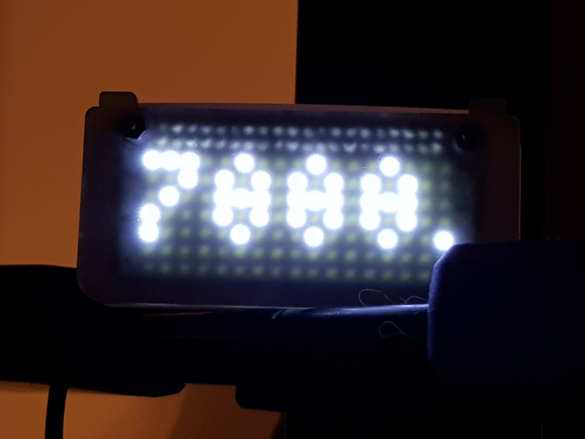

crypto currency ticker sourced from bitstamp & displayed on pimoroni's Scroll pHAT HD running on the raspberry pi.

default supporting bitcoin, ethereum, litecoin.

----
## Requirements

* **Hardware**:
    - Raspberry pi (zero recommended)
    - Scroll pHAT HD  17x7 bright white pixels [https://shop.pimoroni.com/products/scroll-phat-hd](https://shop.pimoroni.com/products/scroll-phat-hd) (BLINKEN LIGHTS!)
* **Recommended **: 
    - Scroll pHAT diffuser [https://shop.pimoroni.com/products/phat-diffuser](https://shop.pimoroni.com/products/phat-diffuser) (Softens BLINKEN LIGHTS!)

## Installation

follow Scroll pHAT HD installation here https://github.com/pimoroni/scroll-phat-hd

simply run hello-crypto.py on your pi! 

## Author

**Glenn Jones**

* Twitter: [@mrglennjones](https://twitter.com/mrglennjones)

also try hello-btc.py for a scrolling btc ticker! which scrolls up for rising values and down for falling! (made by pbpraha)

